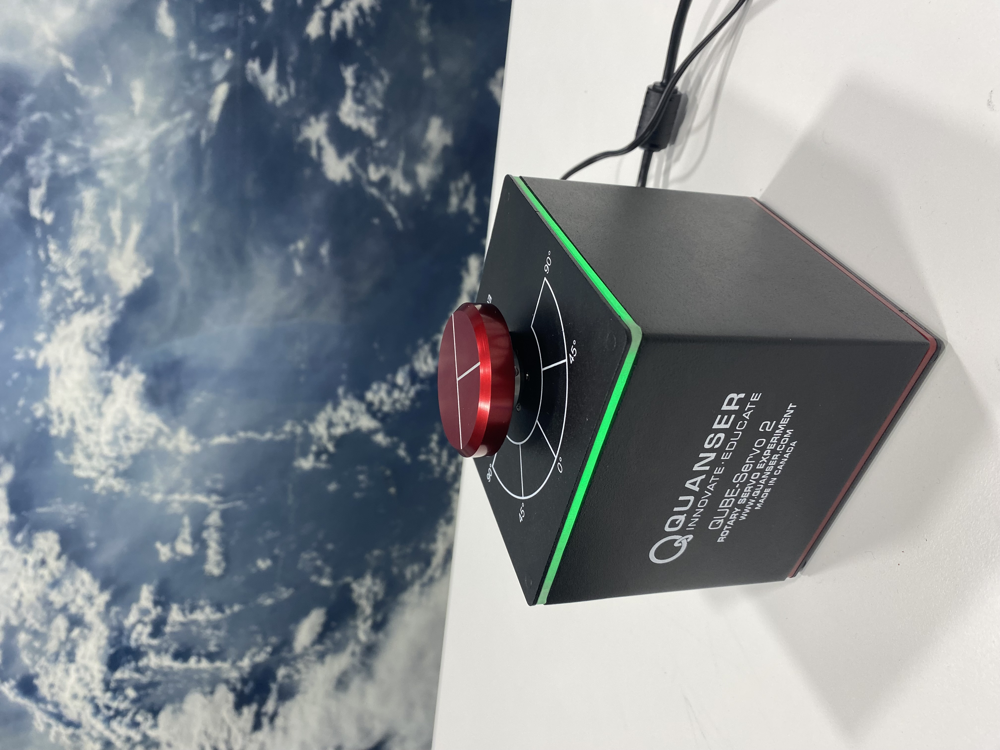

# Quanser QUBE Servo 2 Control Implementation

A comprehensive Python implementation of PID and LQR controllers for the Quanser QUBE Servo 2. This project demonstrates classical and modern control techniques for two distinct modules:

1. **Disk Module**: Angle control using PID controller
2. **Rotary Inverted Pendulum Module**: Pendulum balancing using LQR controller

| Disk Module | Pendulum Module |
|------------|----------------|
|  |  |

## Demo Video
Check out the controller implementations in action:

[](https://www.youtube.com/watch?v=YevSQ600GKA)

## Project Overview

This repository contains a complete implementation of both PID (Proportional-Integral-Derivative) and LQR (Linear Quadratic Regulator) controllers for the Quanser QUBE Servo 2 platform. The project implements two distinct control scenarios:

1. **Disk Module Control (PID)**
   - Position control of the rotary disk
   - Classical control approach with real-time tracking
   - Butterworth filtering for smooth control

2. **Inverted Pendulum Control (LQR)**
   - Full state feedback for pendulum balancing
   - Energy-based swing-up control
   - Automatic transition between swing-up and balance

Additional features include:
- Real-time control implementation
- State estimation and filtering
- Performance visualization and analysis

## Code Structure

The project is organized into two main control implementations:

### LQR Implementation (`/lqr`)
- `Qube.py`: Hardware interface class for the QUBE Servo 2
- `LQR.py`: LQR controller implementation with energy-based swing-up control
- `lqr_controller.py`: Main execution script for LQR control
- `gain_matrices.ipynb`: Jupyter notebook for calculating LQR gain matrices

### PID Implementation (`/pid`)
- `Qube.py`: Hardware interface class (shared with LQR)
- `Pid.py`: PID controller implementation with filtering capabilities
- `pid_controller.py`: Main execution script for PID control

### Key Components

#### Qube Class
The `Qube` class serves as the hardware abstraction layer:
- Manages communication with the QUBE Servo 2 hardware
- Handles encoder readings and motor control
- Provides LED feedback control
- Implements safety features and graceful shutdown

#### PID Controller
The `Pid` class implements:
- Configurable PID gains
- Real-time error tracking
- Signal filtering using Butterworth filters
- Comprehensive data logging for analysis
- Built-in plotting capabilities for performance visualization

#### LQR Controller
The `LQR` class features:
- State feedback control
- Energy-based swing-up control
- Performance visualization

## Installation

### Prerequisites
- Python 3.12
- Quanser Software 2023
- Operating Systems (tested and verified):
  - Windows 11
  - macOS Sonoma (14.3)

### Setup Steps

1. Install Python 3.12 from [python.org](https://www.python.org/downloads/)
   - Select "Add Python.exe to Path"
   - Enable "Using Admin Privilege when installing Py.exe"

2. Install required Python packages:
```bash
python -m pip install --upgrade pip
pip install numpy opencv-python matplotlib scipy pyserial IPython
```

3. Install Quanser SDK:
```bash
cd %QUARC_DIR%/python
python -m pip install --find-links . quanser_api-2023.10.20-py2.py3-none-any.whl
```

4. Install Quanser Interactive Labs:
```bash
curl -L -o install.py https://raw.githubusercontent.com/quanser/Quanser_Interactive_Labs_Resources/main/install.py
python install.py
```

## Usage

### PID Control
```python
python pid/pid_controller.py
```
- Implements position control of the rotary arm
- Configurable PID gains
- Real-time performance plotting

### LQR Control
```python
python lqr/lqr_controller.py
```
- Full state feedback control
- Automatic swing-up and balance
- State estimation and filtering

## Results and Visualization

Both controllers include built-in visualization tools that display:
- System response
- Control inputs
- State trajectories
- Error signals
- Controller performance metrics


## License

This project is licensed under the MIT License - see the LICENSE file for details.

## Acknowledgments

- Quanser for providing the QUBE Servo 2 platform
- Control Systems community for theoretical foundations
- Contributors and testers who helped improve the implementation

## Contact

For questions and feedback, please open an issue or contact the repository owner.

